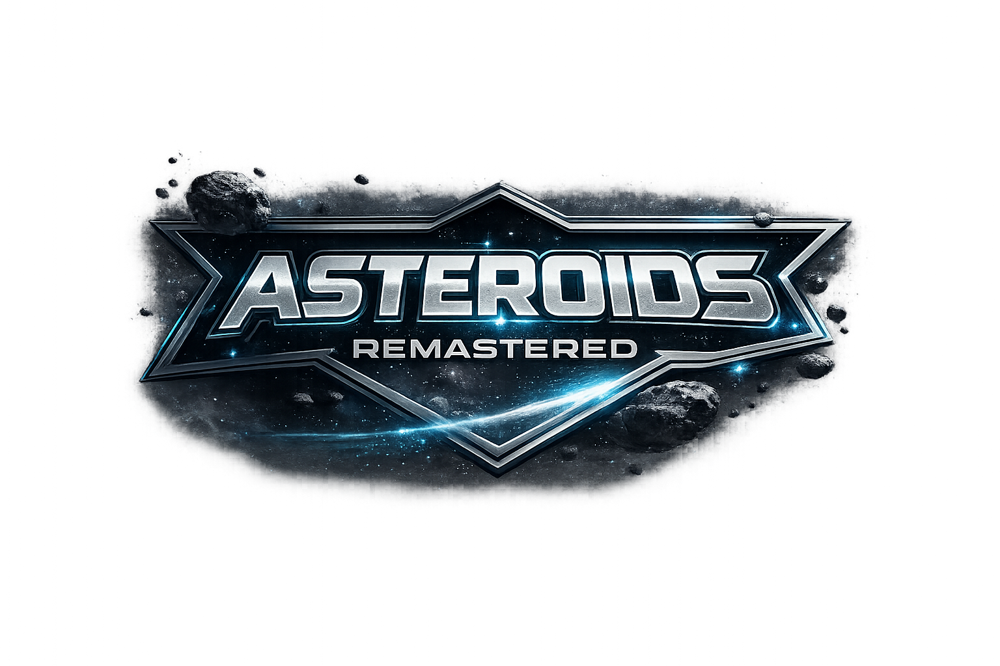

Remastered version of the incredible Asteroids (1979) retro space-game.


[](https://github.com/matyasjay/asteroids/actions/workflows/tests.yml)

## Makefile Commands

```bash
# Install/update dependencies
make sync

# Run from source
make run

# Run tests
make test

# Build macOS app bundle (ARM64 on Apple Silicon)
make build

# Open built app
make open
```

- `make build` generates a macOS `.icns` icon from `sprites/ship.png` (`build-icon`) and passes it to PyInstaller.
- `make test` runs `pytest` in headless pygame mode.
- Cleanup helpers:
  - `make clean` removes `build/`, `dist/`, and `asteroids.spec`
  - `make distclean` also removes all `__pycache__/` directories

## Testing

- Test runner: `pytest` (headless pygame setup via `tests/conftest.py`).
- Local run: `make test` (or `uv run --group dev pytest`).
- CI: `.github/workflows/tests.yml` runs tests on pushes to `main` and on pull requests.

## Release Process

Releases are manual via GitHub Actions (`workflow_dispatch`) using `.github/workflows/release.yml`.

- Run from branch: `main` only.
- Inputs: `release_strategy` (`auto | major | minor | patch`), `prerelease`, `dry_run`.
- SemVer for `auto`: `major` on breaking changes, `minor` on `feat:`, `patch` on `fix:`, `perf:`, or `refactor:`.
- Real release runs update `pyproject.toml` and `CHANGELOG.md`, then create/push the release tag.
- Real release runs also build and upload PyInstaller archives for `macos-arm64`, `macos-x64`, `windows-x64`, and `linux-x64`.
- Build pipeline derives app icons from `sprites/ship.png` (titlebar icon in windowed mode and packaged binary icon).
- macOS artifacts are unsigned and may require manual “Open Anyway” in system settings.

## Project Structure

```text
game/
  config/     # Game constants and tuning knobs
  core/       # Shared base types (e.g. CircleShape)
  entities/   # Player, asteroids, shots
  systems/    # Spawners and game systems
  render/     # Texture/sprite helpers
  utils/      # Logging and diagnostics
main.py       # Entry point
images/       # UI/background/loading art
sprites/      # Art assets
```

## High-Level Concepts

This codebase is organized around a small game loop plus modular gameplay/rendering components.

- `main.py`:
  - Owns the top-level state machine (`menu`, `playing`, `game_over`).
  - Runs startup bootstrapping (`StartupScreen`) and prewarms heavy render assets.
  - Processes input events and core gameplay rules (damage, collisions, transitions).
  - Creates and resets game sessions (sprite groups + runtime state like health).
- `game/config/constants.py`:
  - Single source of truth for tunables: physics, timings, screen size, assets, UI layout.
  - Changing gameplay feel should usually start here.
- `game/core/circleshape.py`:
  - Base class for circular world objects.
  - Provides shared data (`position`, `velocity`, `radius`) and behavior (`collides_with`, `wrap_around_screen`).
- `game/entities/player.py` (`Player`):
  - Handles movement, rotation, acceleration, shooting, cooldowns, and invulnerability visuals.
  - Extends `CircleShape`.
- `game/entities/asteroid.py` (`Asteroid`):
  - Asteroid movement and split behavior.
  - Uses sprite textures generated by `game/render/asteroid_texture.py`.
  - Extends `CircleShape`.
- `game/entities/shot.py` (`Shot`):
  - Projectile lifetime, movement, wrap behavior, and directional sprite rendering.
  - Extends `CircleShape`.
- `game/entities/explosion.py` (`Explosion`):
  - Visual effect entity for asteroid hits (GIF frames when available, procedural fallback otherwise).
- `game/systems/asteroidfield.py` (`AsteroidField`):
  - Spawning system that periodically injects asteroids into the world.
- `game/render/renderer.py` (`GameRenderer`):
  - Centralized rendering and presentation layer.
  - Loads/caches backgrounds, menu option images, border frame, fonts.
  - Draws each scene and presents the fixed-size game surface centered inside the display.
- `game/render/startup.py` (`StartupScreen`):
  - Handles launch-time loading screen rendering.
  - Displays `images/loading.png` inside the same centered viewport composition used by gameplay.
  - Enforces minimum loading-screen duration and keeps the window responsive while assets warm up.
- `game/render/asteroid_texture.py`:
  - Loads asteroid sprite variants, selects by size class, scales/caches textures.
- `game/utils/logger.py`:
  - Lightweight structured logging for game state and gameplay events.

### Architecture Diagram

```text
                        +----------------------+
                        |       main.py        |
                        | boot + loop + states |
                        +----------+-----------+
                                   |
                +-------------------+---------------------------+
                |                   |                           |
      +---------v---------+ +-------v--------+         +--------v--------+
      |    StartupScreen  | |   Game Session |         |   GameRenderer  |
      | loading image +   | | pygame groups +|         | draw scenes +   |
      | min startup time  | | runtime state  |         | present display |
      +-------------------+ +-------+--------+         +--------+--------+
                                    |                           |
                            +-------+--------+          +-------+------------------+
                            |                |          |                          |
                       +----v-----+   +------v-------+  |  backgrounds/border/     |
                       | updatable|   |   drawable   |  |  menu assets + viewport  |
                       | sprites  |   |   sprites    |  |  composition              |
                       +----+-----+   +------+-------+  +---------------------------+
                            |                |
  +-------------------------v----------------v-------------------------+
  | entities: Player, Asteroid, Shot, Explosion                       |
  | base behavior from CircleShape (position/velocity/radius,         |
  | collision checks, wrap-around)                                    |
  +-------------------------+------------------------------------------+
                            |
                       +----v-------------------+
                       | systems: AsteroidField |
                       | (spawning/timing)      |
                       +------------------------+
```

### Runtime Model

- Startup phase:
  - `StartupScreen` draws the loading image and frame while renderer/texture resources are initialized.
  - A minimum startup duration prevents quick-load flicker on fast machines.
- Simulation updates on a fixed loop cadence (`clock.tick(60)` target).
- Entities are grouped by `pygame.sprite.Group` roles:
  - `updatable`: receives `update(dt)`.
  - `drawable`: receives `draw(surface)`.
  - Specialized groups (`asteroids`, `shots`, `explosions`) support game rules and collision checks.

## Gameplay Extension

- [ ] Add a scoring system
- [x] Implement multiple lives and respawning
- [x] Add an explosion effect for the asteroids
- [x] Add acceleration to the player movement
- [x] Make the objects wrap around the screen instead of disappearing
- [x] Add a background image
- [ ] Create different weapon types
- [x] Make the asteroids lumpy instead of perfectly round
- [x] Make the ship have a triangular hit box instead of a circular one
- [ ] Add a shield power-up
- [ ] Add a speed power-up
- [ ] Add bombs that can be dropped

## Optimization Roadmap

- [ ] Add collision broad-phase (spatial hash/grid) to avoid nested asteroid-shot checks each frame.
- [ ] Invalidate and rebuild sprite transform caches after display mode changes (F11) to avoid render artifacts.
- [ ] Replace the session dictionary with a typed dataclass (`GameSession`) for safer state access and easier refactors.
- [ ] Add an `AssetManager` for centralized loading/pre-scaling and consistent asset error handling.
- [ ] Split the loop into fixed-timestep update and variable render for stable gameplay under frame drops.
- [x ] Add tests for critical behavior: state transitions, health/invulnerability flow, and wraparound.
